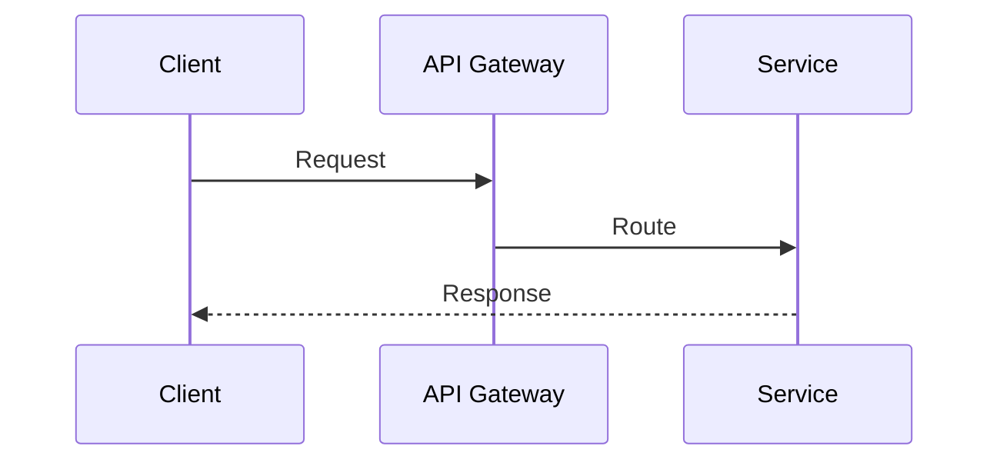

# write-docs

## Project Locations

Khi tạo hoặc chỉnh sửa doc, **luôn dùng absolute path** sau:

| Project | Thư mục content |
|---------|----------------|
| `aws-learn` | `/home/hieptran/Desktop/aws-learn/content/docs/` |
| `microservice-learn` | `/home/hieptran/Desktop/microservice-learn/content/docs/` |
| `multi-tenant` | `/home/hieptran/Desktop/multi-tenant/content/docs/` |

Nếu user không chỉ rõ project, hỏi trước khi tạo file.

## Stack & Project Structure

Cả 3 project dùng cùng stack:

```
Next.js 15 + Fumadocs + Cloudflare Pages
```

```
repo/
├── content/docs/          # Toàn bộ .md files
│   ├── {category}/        # Folder theo chủ đề (aws-learn, microservice-learn)
│   │   ├── meta.json      # { "title": "Category Name" }
│   │   └── *.md           # Các doc files
│   └── meta.json          # Root: định nghĩa thứ tự sidebar
├── package.json
├── wrangler.toml
└── AGENTS.md / CLAUDE.md
```

> **multi-tenant** không có subfolder — `.md` files nằm thẳng trong `content/docs/`.

**Naming convention:**
- Category-based (aws-learn style): `dynamodb.md`, `api-gateway.md`
- Sequential (microservice style): `01-overview.md`, `02-patterns.md`

## Ngôn ngữ

**Tất cả nội dung doc phải viết bằng tiếng Việt.** Chỉ giữ tiếng Anh cho:
- Tên kỹ thuật, service, tool (DynamoDB, Circuit Breaker, gRPC, ...)
- Code, CLI commands, config values
- URL, tên file, biến số

Không dịch sai nghĩa — nếu không có từ tiếng Việt phù hợp, giữ nguyên tiếng Anh kèm giải thích lần đầu xuất hiện.

## Page Ordering — Đảm bảo thứ tự sidebar

**Mọi file mới phải được đăng ký trong `meta.json` ngay khi tạo.** Fumadocs chỉ hiển thị và sắp xếp các page theo `"pages"` array — không tự detect.

### Quy tắc bắt buộc khi thêm doc mới

1. **Category `meta.json`** — thêm tên file (không có `.md`) vào đúng vị trí logic:
```json
{
  "title": "Database",
  "pages": [
    "dynamodb",
    "rds",
    "aurora",
    "elasticache"
  ]
}
```

2. **Root `meta.json`** — thêm category nếu category mới:
```json
{
  "pages": [
    "fundamentals",
    "compute",
    "storage",
    "database"
  ]
}
```

3. **Thứ tự trong `"pages"` = thứ tự trong sidebar** — đặt theo logic học tập (cơ bản trước, nâng cao sau), không phải alphabetical.

4. **Sequential repos** (kiểu microservice): dùng prefix số `01-`, `02-`, ... trong tên file để đảm bảo thứ tự kể cả khi quên update meta.json.

> [!IMPORTANT]
> Nếu file không có trong `"pages"` của `meta.json` → **doc sẽ không xuất hiện trên sidebar**, dù file tồn tại.

### Sidebar khi mix file và folder

Fumadocs sort **folders khác với files** khi không có `"pages"` array. Để giữ đúng thứ tự khi một file được chuyển thành folder (xem phần dưới), **bắt buộc thêm `"pages"` array vào root hoặc parent `meta.json`** liệt kê cả tên folder lẫn tên file theo thứ tự muốn hiển thị:

```json
{
  "pages": [
    "01-overview",
    "02-isolation-models",
    "03-data-partitioning",
    "04-tenant-identity"
  ]
}
```

> Nếu `"pages"` array đã tồn tại — chỉ thêm entry mới vào đúng vị trí, **không xóa hay ghi đè toàn bộ file**.

## Sub-page / Child Page Structure (Fumadocs)

Dùng khi một section trong một `.md` file quá dài hoặc cần tách thành nhiều trang con hiển thị dạng **collapsible group** trong sidebar.

### Khi nào nên tách

- Section hiện tại chỉ có bảng tóm tắt, cần một trang riêng giải thích chi tiết
- Nội dung có thể đứng độc lập (ví dụ: danh sách kỹ thuật, runbook, case study phụ)
- Muốn sidebar hiển thị dạng group thay vì flat list

### Pattern: file → folder/index + child pages

```
Trước:
content/docs/
└── 02-isolation-models.md

Sau:
content/docs/
└── 02-isolation-models/
    ├── index.md               ← nội dung gốc của 02-isolation-models.md
    ├── isolation-techniques.md  ← trang con mới
    └── meta.json              ← định nghĩa group title + thứ tự pages con
```

**Kết quả sidebar:**
```
├── Tổng quan
├── Isolation Models            ← collapsible group (từ folder)
│   ├── Tenant Isolation Models ← index.md
│   └── Các Kỹ thuật Enforce Isolation ← isolation-techniques.md
├── Data Partitioning
└── ...
```

### Các bước thực hiện

**Bước 1 — Chuyển file thành folder:**
```bash
# Tạo thư mục và di chuyển file
mkdir content/docs/02-isolation-models
mv content/docs/02-isolation-models.md content/docs/02-isolation-models/index.md
```

**Bước 2 — Tạo trang con:**

Tạo `content/docs/02-isolation-models/isolation-techniques.md` với frontmatter đầy đủ:
```yaml
---
title: "Các Kỹ thuật Enforce Isolation"
description: "Chi tiết các kỹ thuật..."
---
```

**Bước 3 — Tạo `meta.json` trong folder con:**

`content/docs/02-isolation-models/meta.json`:
```json
{
  "title": "Isolation Models",
  "pages": [
    "index",
    "isolation-techniques"
  ]
}
```

- `"title"` → tên hiển thị của collapsible group trên sidebar
- `"pages"` → thứ tự các trang con; `"index"` luôn là trang đầu tiên (= `index.md`)

**Bước 4 — Fix thứ tự sidebar ở root/parent `meta.json`:**

Khi chuyển file thành folder, Fumadocs có thể sort lại. Thêm `"pages"` array vào `meta.json` cấp cha nếu chưa có:
```json
{
  "pages": [
    "01-overview",
    "02-isolation-models",
    "03-data-partitioning"
  ]
}
```

> [!IMPORTANT]
> Nếu `meta.json` cha **đã có** `"pages"` array → chỉ kiểm tra xem `"02-isolation-models"` đã trong list chưa. Tên folder dùng như tên file (không có extension). Không cần thêm gì nếu đã có.

### Quy tắc không ghi đè meta.json

**Không bao giờ overwrite `meta.json` đã tồn tại.** Luôn:
1. Đọc nội dung hiện tại trước
2. Chỉ thêm `"pages"` array nếu chưa có, hoặc thêm entry mới vào đúng vị trí trong array đã có
3. Giữ nguyên các field khác (`"title"`, custom fields)

Áp dụng cho cả script tự động (ví dụ `prepare-content.mjs`) — xem phần dưới.

## Scripts tự động (prepare-content.mjs)

Nếu repo có script sinh meta.json tự động khi dev/build, script **phải kiểm tra trước khi ghi**:

```js
// Đúng — không ghi đè nếu đã tồn tại
import { existsSync } from 'fs';

if (!existsSync(metaJsonPath)) {
  fs.writeFileSync(metaJsonPath, JSON.stringify(content, null, 2));
}
```

```js
// Sai — ghi đè mọi lúc, xóa mất cấu hình tay
fs.writeFileSync(metaJsonPath, JSON.stringify(content, null, 2));
```

Nếu script cần update `"pages"` array, chỉ thêm entry còn thiếu, không reset toàn bộ array.

## Document Structure Chuẩn

Mọi doc đều theo template sau — xem chi tiết trong [`references/doc-template.md`](references/doc-template.md).

### Frontmatter (bắt buộc)
```yaml
---
title: "Tên Service hoặc Topic"
description: "Mô tả ngắn gọn 1 dòng, ưu tiên keywords quan trọng"
---
```

### Heading Hierarchy
```
# Tên Doc (H1)

## Mục lục (H2) — Table of Contents với anchor links
- [Tổng quan](#tổng-quan)
- [Core Concepts](#core-concepts)
...

---   ← dấu phân cách

## Tổng quan (H2) — major sections
### 1.1 Subsection (H3)
#### Chi tiết (H4) — chỉ dùng khi thực sự cần
```

### Sections bắt buộc theo loại doc
- **Service reference** (kiểu aws-learn): xem [`references/aws-style.md`](references/aws-style.md)
- **Architecture/Pattern** (kiểu microservice): xem [`references/microservice-style.md`](references/microservice-style.md)
- **Case Study**: xem [`references/case-study-style.md`](references/case-study-style.md)

## Độ chi tiết

| Level | Khi nào dùng | Dấu hiệu |
|-------|-------------|----------|
| Overview | Giới thiệu concept | 1-2 paragraphs, 1 diagram |
| Standard | Doc thông thường | 3-5 H2 sections, tables, code examples |
| Deep-dive | Service phức tạp / case study | 10+ H2, multiple diagrams, runbooks |

**Nguyên tắc:**
- Không giải thích cái đã hiển nhiên — đọc giả là engineer
- Mỗi section phải trả lời được câu hỏi: "Tại sao tôi cần biết điều này?"
- Ưu tiên bảng so sánh và diagram hơn prose dài dòng

## Diagrams & Visualization

**ASCII art** — dùng cho architecture tĩnh:
```
┌──────────────┐     ┌──────────────┐
│   Service A  │────▶│   Service B  │
└──────────────┘     └──────────────┘
```

**Mermaid** — dùng cho flow và sequence:
````

````

**Admonitions** (GitHub-style):
```markdown
> [!IMPORTANT]
> Điểm quan trọng cần nhớ

> [!TIP]
> Mẹo thực tế

> [!NOTE]
> Thông tin bổ sung
```

## Syntax Gotchas

Các lỗi hay gặp khi viết `.md` cho Fumadocs — xem đầy đủ trong [`references/md-syntax.md`](references/md-syntax.md).

**Nhanh:**
- Frontmatter `title` + `description` bắt buộc
- Internal links phải có trailing slash: `/basics/overview/`
- JSX components cần dòng trống trước và sau
- Code blocks phải ghi language: ` ```bash `
- Không bỏ qua cấp heading (H2→H3→H4)

## Fumadocs Components

Các component UI có thể dùng trực tiếp trong file `.md` **không cần import** — đã đăng ký global trong `page.tsx`.

| Component | Dùng cho |
|-----------|---------|
| `<Callout>` | Cảnh báo, tip, lưu ý (thay thế `> [!NOTE]`) |
| `<Cards>` + `<Card>` | Navigation, link tới trang liên quan |
| `<Steps>` + `<Step>` | Hướng dẫn từng bước, setup guide |
| `<Tabs>` + `<Tab>` | So sánh multi-platform, code nhiều ngôn ngữ |
| `<Accordions>` + `<Accordion>` | FAQ, nội dung optional |
| `<TypeTable>` | Mô tả config, API options, env vars |
| ` ```mermaid ` | Flow diagram, sequence diagram |

Xem ví dụ đầy đủ và hướng dẫn dùng từng component: [`references/fumadocs-components.md`](references/fumadocs-components.md)

## Setup Repo Mới

Xem hướng dẫn đầy đủ trong [`references/setup-deploy.md`](references/setup-deploy.md) — bao gồm:
- Mermaid diagram support (cài đặt + remark plugin + component)
- Fix route conflict Next.js 15.5+
- Mở rộng content area CSS
- Font JetBrains Mono cho code blocks (`@fontsource/jetbrains-mono` hoặc `next/font/google`)

**TL;DR:**
```bash
# Clone từ repo mẫu
git clone https://github.com/vanhiep99w/aws-learn my-docs
cd my-docs
npm install
npm run dev    # localhost:3000
npm run deploy  # = next build + wrangler pages deploy dist
```

`wrangler.toml` tối thiểu:
```toml
name = "my-docs-site"
pages_build_output_dir = "./dist"
```

## Workflow Tạo Doc Mới

1. Chọn category folder phù hợp (hoặc tạo mới + `meta.json`)
2. Copy từ template: [`references/doc-template.md`](references/doc-template.md)
3. Điền frontmatter `title` + `description` — **bằng tiếng Việt**
4. Viết `## Mục lục` trước — outline giúp tránh bỏ sót section
5. Viết từng section bằng tiếng Việt: Tổng quan → Core Concepts → Use Cases → Best Practices
6. **Thêm ngay vào `meta.json`** của category (đúng vị trí thứ tự, không append cuối mù quáng)
7. Nếu category mới: thêm category vào root `meta.json` theo thứ tự logic
8. Chạy `npm run dev` — kiểm tra doc xuất hiện đúng vị trí trên sidebar trước khi commit

## Workflow Tách Section thành Child Page

Dùng khi section hiện có quá sơ sài và cần trang riêng chi tiết hơn, hiển thị dạng child trong sidebar.

1. **Đánh giá:** section chỉ có bảng tóm tắt / cần nội dung độc lập → phù hợp tách
2. **Chuyển file → folder:** `N-topic.md` → `N-topic/index.md` (giữ nguyên nội dung gốc)
3. **Tạo trang con:** `N-topic/child-name.md` với frontmatter đầy đủ và nội dung chi tiết
4. **Tạo `N-topic/meta.json`:** định nghĩa `"title"` (tên group) và `"pages": ["index", "child-name"]`
5. **Kiểm tra parent `meta.json`:** nếu chưa có `"pages"` array → thêm vào để fix sidebar order; nếu đã có → chỉ verify tên folder đã trong list
6. **Không overwrite bất kỳ `meta.json` nào** — đọc trước, patch sau
7. Chạy `npm run dev` — verify sidebar hiển thị đúng group collapsible
